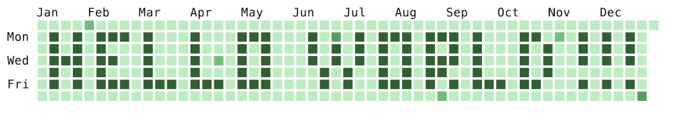

<!-- HEADER IMAGE -->

  

<!-- PROFILE IMAGE -->

  

<h1 align="center">I'm Hemashree Kilari 👋</h1>

  🎓 M.S. in Data Science @ Northeastern University | 💻 Data Scientist | 🔬 ML Enthusiast  

  <a href="mailto:kilari.h@northeastern.edu">📧 Email</a> •
  <a href="https://www.linkedin.com/in/hemashreekilari/">🔗 LinkedIn</a> •
  <a href="https://github.com/H-E-M-A-27">💻 GitHub</a> •
  📍 Boston, MA

---

## 🧠 Tech Stack

### 👩‍💻 Languages & Tools

  
  
  
  
  
  
  
  
  
  

### ☁️ Cloud & Platforms

  
  
  

---

## 🏢 Experience

### 🖥️ **eClinicalWorks** — *Applications Systems Analyst* (Jun 2024 – Present)
- Resolved 100+ HL7 interface issues monthly ensuring seamless healthcare data flow  
- Collaborated on 30+ live interface deployments enhancing workflow by 15%  
- Ensured timely, compliant, and technically sound support across healthcare systems

### 🌞 **Power Factors** — *Data Science Co-op* (Sep 2023 – Dec 2023)
- Upgraded degraded classifiers for solar PV system monitoring  
- Relabeled 50+ datasets boosting dataset accuracy by ~20%  
- Built an anomaly detection pipeline to optimize solar system maintenance

### 🧪 **Triad Square InfoSec** — *Data Science Intern* (Sep 2021 – Dec 2021)
- Designed YOLOv4 + Kalman filter–based social distancing tracker  
- Built Tableau dashboards with COVID-19 trends & Twitter sentiment analysis in Bangalore

### ⚙️ **Hitachi ABB** — *Product Dev Intern* (Apr 2021 – Sep 2021)
- Developed HV product configurators using Java & VRML  
- Solved 70%+ client issues and conducted technical sessions for internal training

---

## 🎓 Education

### 📘 Northeastern University – *Boston, USA*  
**M.S. in Data Science** — GPA: 3.92 (Sep 2022 – Dec 2024)  
**Courses:** Machine Learning, Data Management, DBMS

### 🎓 GITAM University – *Visakhapatnam, India*  
**B.Tech in CSE** — GPA: 3.71 (Jun 2018 – May 2022)

---

## 💡 Projects

### ☀️ [**Solar Vision**](https://www.linkedin.com/posts/hemashreekilari_solarvision-forecasting-machinelearning-activity-YOUR-LINKEDIN-POST-ID)  
*ML Forecasting for Solar Energy Output*  
- Hybrid ARIMA-LSTM model built in Python  
- Achieved 97.29% R² score for solar energy predictions  

### 🎗 [**Breast Cancer Prediction**](https://www.linkedin.com/posts/hemashreekilari_machinelearning-breastcancer-python-activity-YOUR-LINKEDIN-POST-ID)  
*ML Classification Model*  
- Used supervised + unsupervised learning  
- Attained 84% classification accuracy  

---

## 🏆 Achievements

- 🧠 **Smart India Hackathon 2021** – Developed a “Voice Prescription” system (University-level selection)  
- 🥇 **1st Place – IETE 2021** – National Tech Expo, Software Category

---

## 📫 Let's Connect!

  
  
  

---

  Made with ❤️ by Hemashree Kilari

